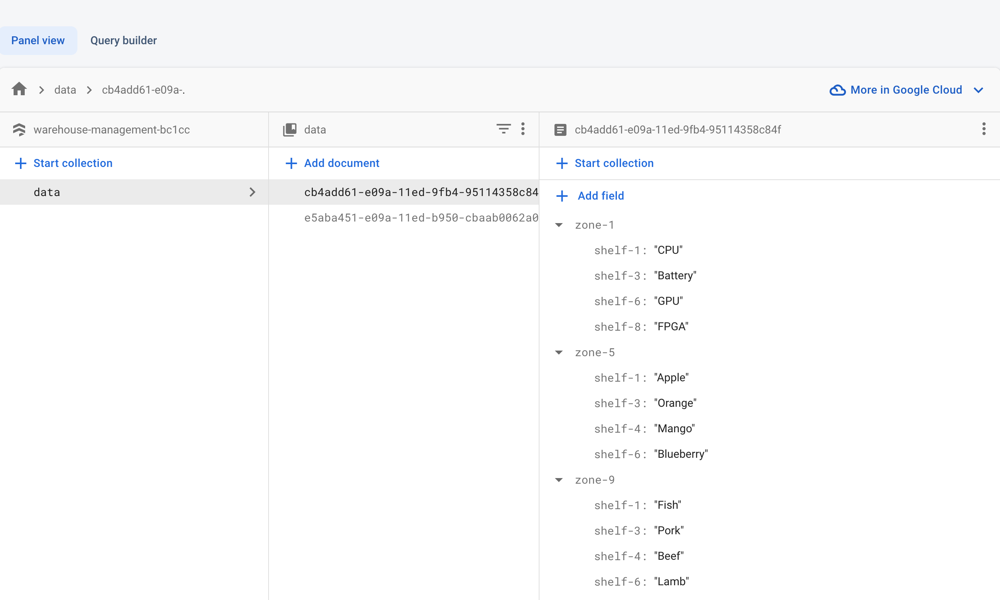

# Getting Started with Create React App

This project was bootstrapped with [Create React App](https://github.com/facebook/create-react-app).

## Available Scripts

In the project directory, you can run:
### `npm install`
### `npm start`

## Deployment
The project is deployed using [Firebase Hosting](https://warehouse-management-bc1cc.web.app/)

## Backend
The project endpoint is connected to the Firebase firestore database

## Database Demo

